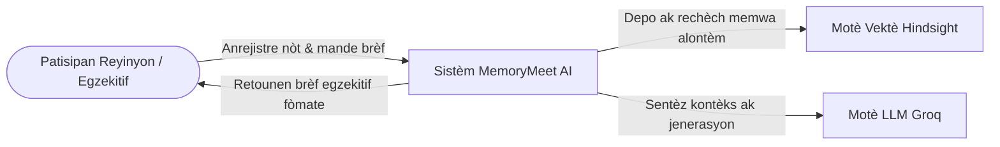
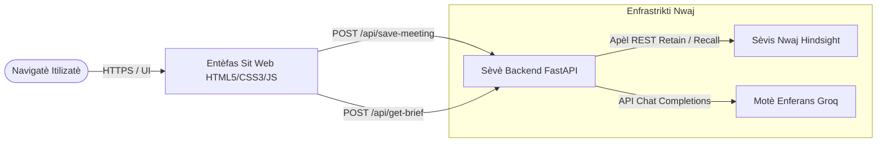
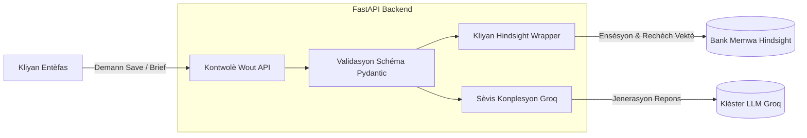
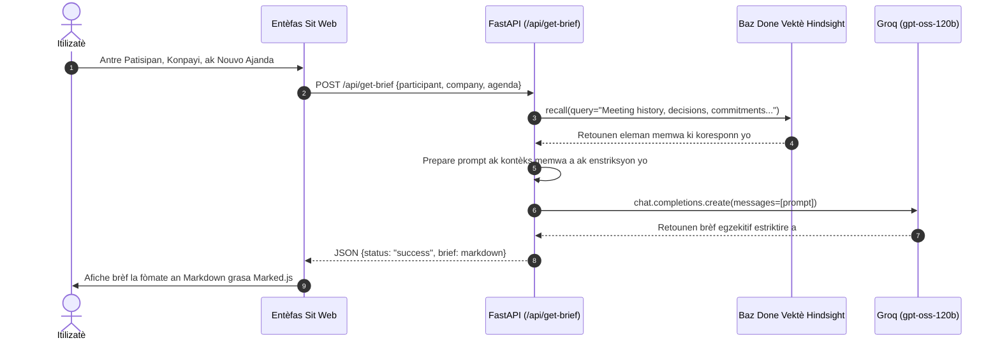

# MemoryMeet AI

Yon platfòm entèlijans atifisyèl pou reyinyon ki kapab sonje kontèks kliyan pase yo, angajman yo te pran, ak nòt istorik yo pou sentetize yon brèf egzekitif preparasyon reyinyon ki klè e aksyonab nan kèk segonn.

**Lyen Pwojè an Liy:**  
https://memorymeet-ai-by-teamrock.onrender.com/

**Depo GitHub:**  
https://github.com/sumanpatro-SC/TeamRock

---

## 1. Definisyon Pwoblèm nan (Problem Statement)

Ekip pwofesyonèl yo, responsab kont yo, ak konsiltan yo souvan antre nan reyinyon ak kliyan oswa patnè san yo pa sonje imedyatman angajman ki te pran anvan yo, risk ki ouvè yo, oswa kontèks pase a.

Nòt reyinyon yo souvan gaye nan divès dokiman, nan sistèm CRM ki pa ajou, oswa yo pèdi nèt, sa ki lakòz:

- Patisipan reyinyon yo pa prepare epi yo bliye angajman anvan yo te pran ak kliyan an.
- Repetisyon kesyon ki diminye konfyans nivo egzekitif la.
- Neglijans sou risk pwojè a ak move aliyman sou atant yo.

---

## 2. Solisyon an: MemoryMeet AI

MemoryMeet AI bay yon sistèm memwa ak preparasyon reyinyon santralize:

1. **Anrejistreman Reyinyon ak Memwa Episodik:**  
   Li estoke nòt ak angajman ki pa estriktire dirèkteman anba non patisipan yo ak konpayi yo grasa bank memwa vektè Hindsight la.

2. **Rapèl Semantik Konpòtmantal:**  
   Li chèche epi li jwenn entèraksyon istorik yo, desizyon yo, ak ajanda anvan yo lè l sèvi avèk rechèch semantik nan langaj natirèl.

3. **Sentèz Egzekitif:**  
   Li itilize motè enferans rapid Groq la (`openai/gpt-oss-120b`) pou prepare brèf estriktire ki gen ladan istorik relasyon an, risk kritik yo, angajman ki rete ouvè yo, ak pwen diskisyon taktik yo.

---

## 3. Achitekti Sistèm nan ak Dyagram

### Nivo 0: Dyagram Kontèks (Context Diagram)



### Nivo 1: Dyagram Kontenè (Container Diagram)



### Nivo 2: Dyagram Konpozan (Component Diagram)



### Nivo 3: Dyagram Sekans (Sequence Diagram)



---

## 4. Zouti Teknoloji yo Itilize (Tech Stack)

| Kategori | Teknoloji |
|---|---|
| **Backend** | FastAPI, Pydantic, Uvicorn |
| **Frontend** | HTML5, CSS3, Vanilla JavaScript, CSS Grid |
| **Markdown Rendering** | Marked.js |
| **Memwa ak Depo** | Hindsight Vector Memory / `hindsight-client` |
| **Motè LLM** | Groq Cloud (`openai/gpt-oss-120b`) |
| **Konfigirasyon** | Python Dotenv (`python-dotenv`) |
| **Deplwaman** | Render |
| **Server** | Uvicorn |

---

## 5. Referans API (API Endpoints)

### `POST /api/save-meeting`

Anrejistre nòt entèraksyon yo epi voye yo nan bank memwa pèmanan an.

#### Request

```json
{
  "participant": "Rahul Sharma",
  "company": "Acme Tech",
  "notes": "Te diskite sou rediksyon delè migrasyon AWS a pa de semèn. Te pwomèt dyagram achitekti a pou vandredi."
}
```

#### Response

```json
{
  "status": "success",
  "message": "Successfully retained memory for Rahul Sharma (Acme Tech)"
}
```

---

### `POST /api/get-brief`

Chèche memwa istorik ki gen rapò ak patisipan an, konpayi an ak ajanda a, epi jenere yon brèf egzekitif.

#### Request

```json
{
  "participant": "Rahul Sharma",
  "company": "Acme Tech",
  "agenda": "Review AWS migration progress and discuss open commitments."
}
```

#### Response

```json
{
  "status": "success",
  "brief": "### Executive Brief...\n1. Executive Summary\n2. Critical Risks..."
}
```

---

## 6. Enstalasyon ak Egzekisyon Lokal

### Kondisyon Preliminè

- Python 3.10+
- Git
- Yon kle API Hindsight
- Yon kle API Groq

### Etap 1: Klone Depo a

```bash
git clone https://github.com/sumanpatro-SC/TeamRock.git
cd TeamRock
```

### Etap 2: Kreye yon Anviwònman Vityèl

#### Windows

```bash
python -m venv venv
venv\Scripts\activate
```

#### macOS / Linux

```bash
python3 -m venv venv
source venv/bin/activate
```

### Etap 3: Enstale Dependans yo

```bash
pip install -r requirements.txt
```

### Etap 4: Konfigire Varyab Anviwònman yo

Kreye yon fichye `.env` nan rasin pwojè a:

```env
HINDSIGHT_API_KEY=kle_hindsight_ou
HINDSIGHT_API_URL=https://api.hindsight.vectorize.io
HINDSIGHT_BANK_ID=Name: OpsMemory Incidents
GROQ_API_KEY=kle_groq_ou
```

> **Remak:** Pa mete kle API reyèl yo dirèkteman nan GitHub. Itilize fichye `.env` lokalman epi asire `.env` ajoute nan `.gitignore`.

### Etap 5: Lanse Sèvè Lokal la

```bash
uvicorn api.index:app --host 0.0.0.0 --port 8000 --reload
```

Apre sèvè a fin lanse, ouvri:

```text
http://localhost:8000
```

---

## 7. Deplwaman an Pwodiksyon (Render)

Pwojè a deplwaye kòm yon Web Service sou Render.

**Lyen Sèvis an Liy:**  
https://memorymeet-ai-by-teamrock.onrender.com/

### Build Command

```bash
pip install -r requirements.txt
```

### Start Command

```bash
uvicorn api.index:app --host 0.0.0.0 --port $PORT
```

### Kalite Enstans

Web Service sou Render.

### Varyab Anviwònman

Nan Render, ajoute varyab sa yo nan **Environment Variables**:

```env
HINDSIGHT_API_KEY=kle_hindsight_ou
HINDSIGHT_API_URL=https://api.hindsight.vectorize.io
HINDSIGHT_BANK_ID=Name: OpsMemory Incidents
GROQ_API_KEY=kle_groq_ou
```

---

## 8. Kouman MemoryMeet AI Fonksyone

Workflow prensipal aplikasyon an:

```text
                ┌──────────────────────┐
                │   Itilizatè / Team   │
                └──────────┬───────────┘
                           │
                           ▼
                ┌──────────────────────┐
                │    Web Interface     │
                │    HTML/CSS/JS       │
                └──────────┬───────────┘
                           │
                           ▼
                ┌──────────────────────┐
                │    FastAPI Backend   │
                └──────────┬───────────┘
                           │
              ┌────────────┴────────────┐
              │                         │
              ▼                         ▼
    ┌──────────────────┐      ┌──────────────────┐
    │ Hindsight Memory │      │    Groq LLM      │
    │  Retain / Recall │      │ gpt-oss-120b     │
    └────────┬─────────┘      └────────┬─────────┘
             │                         │
             └────────────┬────────────┘
                          │
                          ▼
                ┌──────────────────────┐
                │ Executive Meeting    │
                │       Brief          │
                └──────────┬───────────┘
                           │
                           ▼
                ┌──────────────────────┐
                │    User Interface    │
                └──────────────────────┘
```

---

## 9. Egzanp Itilizasyon

### Anrejistre yon Reyinyon

Yon itilizatè ka anrejistre yon entèraksyon tankou:

```text
Participant:
Rahul Sharma

Company:
Acme Tech

Notes:
Te diskite sou rediksyon delè migrasyon AWS a pa de semèn.
Te pwomèt dyagram achitekti a pou vandredi.
```

MemoryMeet AI konsève enfòmasyon sa yo nan memwa Hindsight la pou yo kapab itilize nan entèraksyon ki vin apre yo.

### Prepare yon Reyinyon

Lè itilizatè a antre yon nouvo ajanda:

```text
Participant:
Rahul Sharma

Company:
Acme Tech

Agenda:
Review AWS migration progress and discuss open commitments.
```

Sistèm nan:

1. Chèche enfòmasyon istorik ki gen rapò ak Rahul Sharma ak Acme Tech.
2. Rekipere desizyon ak angajman ki enpòtan yo.
3. Konbine kontèks istorik la ak nouvo ajanda a.
4. Voye enfòmasyon an bay Groq LLM.
5. Jenere yon brèf egzekitif estriktire.
6. Afiche rezilta a sou entèfas la.

---

## 10. Karakteristik Prensipal

- 🧠 **Long-Term Meeting Memory**
- 🔎 **Semantic Memory Recall**
- 📝 **Meeting Notes Storage**
- 🤖 **AI Executive Brief Generation**
- ⚠️ **Critical Risk Identification**
- 📌 **Open Commitment Tracking**
- 💬 **Natural Language Context Retrieval**
- ⚡ **Fast LLM Inference with Groq**
- ☁️ **Cloud Deployment with Render**
- 🔗 **Hindsight Vector Memory Integration**

---

## 11. Sekirite ak Konfigirasyon

Pou pwoteje enfòmasyon sansib ak kle API yo:

- Pa mete kle API yo nan source code la.
- Pa komèt `.env` nan Git.
- Itilize Environment Variables sou Render.
- Ajoute `.env` nan `.gitignore`.

Egzanp `.gitignore`:

```gitignore
.env
venv/
__pycache__/
*.pyc
```

---

## 12. Estrikti Pwojè a

Yon estrikti tipik pwojè a kapab sanble ak:

```text
TeamRock/
│
├── api/
│   └── index.py
│
├── frontend/
│   ├── index.html
│   ├── style.css
│   └── script.js
│
├── requirements.txt
├── .env
├── .gitignore
└── README.md
```

---

## 13. Objektif Pwojè a

Objektif MemoryMeet AI se diminye tan ki nesesè pou prepare yon reyinyon lè li mete kontèks istorik, desizyon, risk ak angajman nan yon sèl workflow entèlijan.

Sistèm nan konbine **memwa alontèm Hindsight**, **rechèch semantik**, ak **Groq LLM inference** pou pwodwi brèf reyinyon ki baze sou kontèks istorik ki disponib.

---

## 14. Lyen Pwojè

**Live Demo:**  
https://memorymeet-ai-by-teamrock.onrender.com/

**GitHub Repository:**  
https://github.com/sumanpatro-SC/TeamRock

---

## 15. Teknoloji

```text
Frontend
HTML5
CSS3
Vanilla JavaScript
Marked.js

Backend
Python
FastAPI
Pydantic
Uvicorn

AI / Memory
Hindsight
Groq Cloud
openai/gpt-oss-120b

Deployment
Render
```

---

## 16. TeamRock

**MemoryMeet AI** se yon pwojè ekip ki fèt pou montre kijan memwa alontèm ak entèlijans atifisyèl kapab itilize ansanm pou amelyore preparasyon reyinyon ak aksè ak kontèks istorik.
